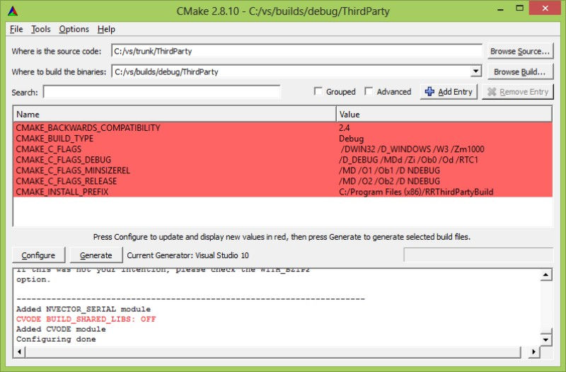

## Introduction
The RoadRunner library is written in C/C++. It has currently been compiled successfully on Windows using Visual Studio and Borland compilers, and on Linux, using the gcc compiler.

Please follow the following steps in order to successfully compile and link the RoadRunner library on your platform.

This document assume a working knowledge of the tools involved, i.e. subversion, CMake and your compiler.

Also, please **observe** that this page outlines a **generic** procedure to build RoadRunner and ThirdParty libraries. For each individual compiler, however, some steps, or variable in the procedure may need a special setting or a tweak. Such tweaks are found on a separate page, associated to the compiler in question. That said, before executing the steps outlined below, please take a look at the specific compiler page for any additional steps needed in order to produce a proper end target.

## The Source
The source code for RoadRunner is managed by a svn repository located on Google code. The build instructions that follows below will assume that you have checked out the code from the **trunk** folder, which has the address:

`http://roadrunnerlib.googlecode.com/svn/trunk/`

Any standard svn client can be used to check out the code.

### The source and ThirdParties
RoadRunner depends on several ThirdParty libraries. On Windows, all such necessary dependencies are satisfied out of the box, while on Linux, various ThirdParties may need to be installed separately. This will be noted in the build instructions as needed.

## Build process overview
The final 'product' of building the RoadRunner source is binary libraries and applications. In short, the libraries will be

 - ThirdParty libraries - various C and C++ libs
 - RoadRunner C++ library
 - RoadRunner C-API library (Wrapper for the C++ library)

Useful applications that can be built are:

- RoadRunner command line application: rr
- RoadRunner command line application: rr_c (application using the C-API of roadrunner)

In short, the whole build process will require the following steps

1. Code is checked out from the repository trunk.
2. The CMake GUI is used to create Build Files for your particular compiler. At least two sets of build files are required to completely build Roadrunner, A) ThirdParty libs build files, and B) build files for the RoadRunner library and RoadRunner applications.
3. The ThirdParty libraries are built and installed using a compiler, by the generated build files from step 2.
4. RoadRunner library, and associated applications are built.

## Get started
In the following we will go through the process of setting up a development environment using the visual studio compiler. However, specific tweaks for any compiler can found be on the specific page associated with the relevant compiler. See below for links to specific compilers.

###Organize your folders
An organized folder setup is recommended. In the following a structure similar to the following will be used:

    top_folder
      builds 
        debug
          rr
          ThirdParty
        release
          rr
          ThirdParty
      installs
        debug
        release
      trunk
    ... 

It is important to note that build files are kept separate from source files, and install files separate from build and source files as well.

##Step 1 - Check out the source code
Check out the trunk from the source code repository, at [https://github.com/AndySomogyi/roadrunner] (Plese see the docs for your svn client on how to do this.) In the following, it is assumed the trunk is checked out to a folder c:\vs\trunk

##Step 2A - Create ThirdParty build files
Open a CMake GUI and

1. Point the 'Where is the source code:' to c:\vs\trunk\ThirdParty
2. Set 'Where to build the binaries:' to c:\vs\builds\debug\ThirdParty
indicating a debug build of the ThirdParties.

Click the **Configure** button and select your desired compiler. In this example, we are using Microsoft's Visual Studio 2010 compiler. At this point, you should see something like the following: 

For our setup, the only modification needed, before generating the build files is
Change the CMAKE_INSTALL_PREFIX from
`C:/Program Files (x86)/RRThirdPartyBuild`

to
C:\vs\installs\debug
After changing the CMAKE_INSTALL_PREFIX option, press configure again and observe that each option has changed color from Red to White. This change indicate success. If success is achieved, click the Generate button in order to generate the actual build files for ThirdParties. At this point, you should have something like this: 

Step 2B - Generate RoadRunner build files
Open a CMake GUI and point the

'Where is the source:' to c:\vs\trunk and
Set 'Where to build the binaries:' to c:\vs\builds\debug\rr
indicating a debug build of RoadRunner sources. Then click the Configure button and select the same compiler and version as in Step 2A. At this point, you should see something like this: 

As for the ThirdParties, modify the CMAKE_INSTALL_PREFIX from C:/Program Files (x86)/rr

to C:\vs\installs\debug

The RoadRunner build needs to know where the ThirdParty library was installed. The option THIRD_PARTY_INSTALL_FOLDER handles this. Modify THIRD_PARTY_INSTALL_FOLDER to point to c:/vs/installs/debug, i.e. to the folder where the ThirdParties were installed.

After changing the CMAKE_INSTALL_PREFIX and the THIRD_PARTY_INSTALL_FOLDER options, press configure again and wait until each option has changed color from Red to White. Then click Generate to generate the actual build files. At this point, the CMake UI should contain something like this: 

Step 3 -Build and install the ThirdParty and RoadRunner library
When the build files have been generated, building and installing the libraries is straightforward. The order is important, however, and the ThirdParty library needs to be built and installed before building and installing RoadRunner itself.

The generated build files comes in various forms, depending on which compiler you selected. Here follows some brief notes on how to deal with the different compilers.

Visual Studio
CMake generates solution (.sln) and project files (.prj) for Visual Studio. Typically the solution file is opened in the Visual Studio UI and the INSTALL target is executed. See screenshot below. More information on how to build RoadRunner using Visual Studio is found on this page: VisualStudioBuild

GCC
CMake generates regular make files for gcc. Installing and building the libraries are then just a matter of executing the command:

make install

in a terminal window. See the page LinuxBuild to get more information on how to build RoadRunner on Linux using the GCC compiler.

Notes on Generating or updating the API Documentation
The documentation is automatically generated using the comments in the copasi_api.h file. To change the documentation, you just need to edit that file. To generate the new documentation, follow these steps:

1) Download and install Doxygen from

http://www.stack.nl/~dimitri/doxygen/download.html#latestsrc
2) Run Doxygen wizard (the executable is usually called doxywizard)

3) In the Doxygen window, enter "Copasi API" as the project name, and provide a version number. Set the copasi-simple-api folder as the source folder and copasi-simple-api/documentation as the destination folder. At the top of the window, specify the working directory as the copasi-simple-api/documentation folder.

4) Click Next. Select "Optimize for C" in the the programming languages option

5) Click Next a few times until you reach the end. At the top of the window

6) Go to the "Run" tab and click "Run doxygen".

7) The documentation has been generated. Use svn commit on the copasi-simple-api/documentation folder to update the online documentation.

8) Tip: You might find that a new html file generated from doxygen does not render in the browser. In order to make the html render correctly, make sure you add the text/html mime type to the file. Under TortoiseSVN, select the file and choose properties from the TortoiseSVN popup menu. Select svn:mime-type in the property type and add text/html to the property value. Select OK and commit the change. The html file will now render correctly.

Alternatively you can make SVN do this for you by editing the SVN configuration file. To do this, select Settings under TortoiseSVN. In the general tab (usually the first you'll see) there is a button marked Edit towards the right hand corner, select this and the config file will be loaded into your favourite editor. In the config file locate the line, miscellany and uncomment the line marked: enable-auto-props = yes. Finally, locate the line [auto-props] and add the following lines to the end of section:

`
*.html = svn:mime-type=text/html
*.css = svn:mime-type=text/css
*.js = svn:mime-type=text/javascript
*.txt = svn:mime-type=text/plain;svn:eol-style=native
*.png = svn:mime-type=image/png
*.jpg = svn:mime-type=image/jpeg
*.pdf = svn:mime-type=application/pdf
*.jpeg = svn:mime-type=image/jpg
*.tiff = svn:mime-type=image/tiff
*.tif = svn:mime-type=image/tiff
`

