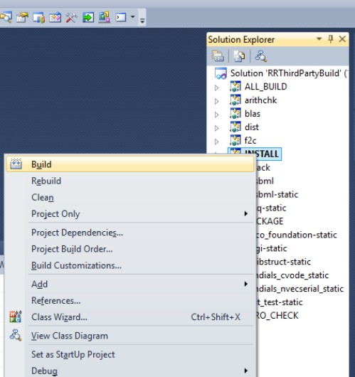
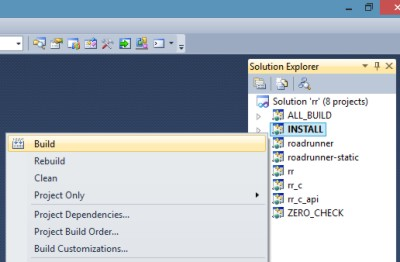
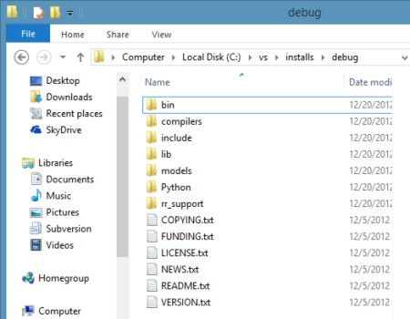



This document contains information on specific steps needed to take in order to build RoadRunner using VS 2010, not found in the 'general' build instructions on the [BuildingRoadRunner](buildrr.html) page.

##CMake Flags
* The CMAKE_BUILD_TYPE

When generating Visual Studio build files, the **CMAKE_BUILD_TYPE** have no effect, i.e. changing the Debug to Release will not cause the build to be a Release build. Instead, Debug and Release is **manually** set in the Visual Studio IDE. This do not mean, however, that one should use one set of build files for both Debug and Release. The problem in doing so, is that this would cause Debug and Release libraries to be generated and installed into the same output folder, which is not considered a good idea.

* The CMAKE_C_FLAGS_RELEASE and CMAKE_CXX_FLAGS_RELEASE

If you are building a **release** version of RoadRunner, the **CMAKE_C_FLAGS_RELEASE** flag and the CMAKE_CXX_FLAGS_RELEASE need to be modified from its default. The default switches
`/O2 /Ob2`

needs to be changed to

`/Od /Ob0`

This need to be observed for both the ThirdParty build, as well as for RoadRunner itself.

The problem seem to be in the CVODE integration library, not being able to converge properly when full optimization is turned on.

##In the Visual Studio IDE
CMake generates **solution** `(\*.sln)` and project `(\*.prj)` files for Visual Studio. To compile, link and install the code, libraries and applications, load the solution file into the IDE. The solution file is a container for individual project files (targets).

The screen shot below shows the **solution explorer** in VS IDE after the solution file for the RoadRunners ThirdParty build is loaded (RRThirdPartyBuild.sln):

In the screenshot, the **INSTALL** target has been selected as the 'Startup Project' (by RightClicking and selecting "Set as Startup Project" from the popup menu).

To build and **install** the project, RightClick on the INSTALL target and select **Build**. See: 

And similarily for the RoadRunner build:

After all is built and installed, the **install folder** will have a bunch of files and directories, see this screen shot:

###What is in the install folder?
* bin: contain **binaries**, such as executable applications, e.g. rr and rr_c as well as shared libraries on windows.
* compilers: currently contain a distribution of the tcc compiler required to compile the sbml model shared library.
* include: contains C/C++ header files for ThirdParties as well as for RoadRunner.
* lib: contains compiled C/C++ link libraries.
* models: contains a few SBML models
* python: contains a python wrapper (rrPython.py) and a minimal python application, rr.py, illustrating how to load a sbml model into roadrunner and then run a simple simulation.
* rr_support: contains headers and sources needed for the "on the fly" compilation of SBML models.
* root_folder: various license and readme files.

##What now?
You have several options on how to use the RoadRunner install files.

###C++
If you are to write your own C++ application, you will want to use the include files in the include/rr folder, and link to libraries in the lib folder.

###C
If you want to use a 'distilled' RoadRunner API, use the rr_c_api.h header in the c_api include folder and corresponding library file, rr_c_api.lib.

###Python
If you are to use Python for development, then use the RoadRunner Python API wrapper, i.e. the rrPython.py file, located in the Python folder. Or load the python file, rr.py into your Python development platform (that implicitly loads the roadrunner python wrapper) and see how to load a sbml model, and do some simulations.

#Visual Studio IDE quirks and tip Recap

Remember the following when using VisualStudio to compile RoadRunner and RoadRunner ThirdParties:

1. Debug and Release builds are manually set from within the VS IDE
2. Do not mix Debug and Release builds, i.e. don't compile the ThirdParties as Release, and RoadRunner as Debug. It will not work and will give build errors.
3. Remember to explicitly install your targets by RightClicking on the INSTALL target and selecting Build.
4. If you are building a release version of RoadRunner, remember to change the CMAKE_C_FLAGS_RELEASE for the ThirdParty build.
5.You will need to unload any solution if you are to update/edit any CMake files. Not doing so can cause a slew of dialog boxes popping up in the IDE.
