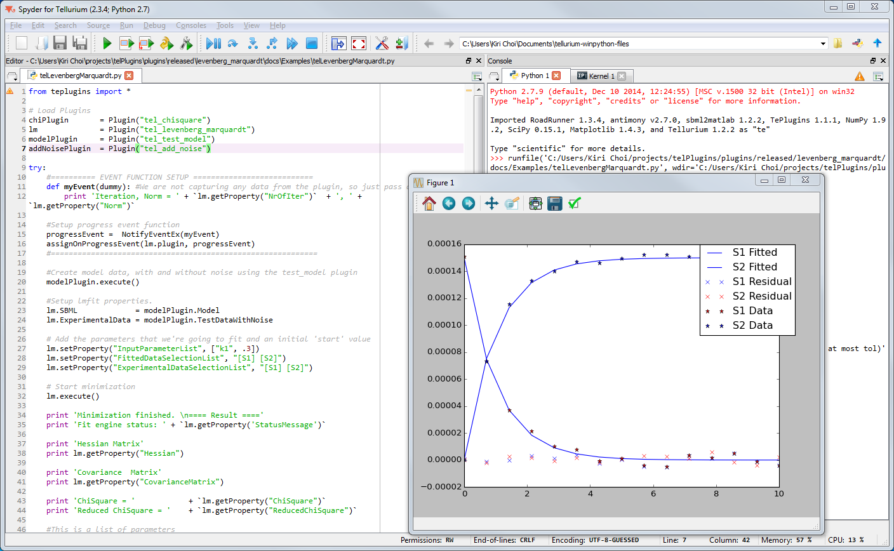

************************************
Levenberg-Marquardt algorithm Plugin
************************************

Levenberg-Marquardt Introduction
================================

The Levenberg-Marquardt plugin is used to fit an SBML model's parameters to experimental data.

The plugin has numerous properties to allow the user full control over the internal fitting engine, as well as access to generated fitted data after a minimization session. In addition, various statistical properties, such as standardized residuals, Q-Q data, ChiSquare and reduced ChiSquare are made accessible to the user. The resulting parameter values also come with estimated confidence limits.

The current implementation is based on the lmfit C library by Joachim Wuttke1.

Levenberg-Marquardt Plugin Properties
=====================================

Available properties in the Levenberg-Marquardt plugin are listed in the table below.
The following properties are used internally by the fitting engine. They are pre-set with default values. Depending on the minimization problem at hand, they may need to be tweaked. 

1. SBML: SBML document as a string. Model to be used in the fitting. 
2. ExperimentalData: Input data. 
3. FittedData: Output data. 
4. InputParameterList: Parameters to fit. 
5. OutputParameterList: List of fitted parameters. 
6. ExperimentalDataSelectionList: Species selection list for experimental data. 
7. FittedDataSelectionList: Selection list for model data. 
8. Norm: Norm of fitting. An estimate of goodness of fit. 
9. Norms: The norm is calculated throughout a fitting session. Each Norm value is stored in the Norms (read-only) property. 
10. ConfidenceLimits: Confidence limits for each fitted parameter. The confidence limits are calculated at a 95% confidence level. 
11. Hessian: Hessian matrix. The Hessian is calculated using approximation at a found parameter minimum. 
12. CovarianceMatrix: Covariance matrix. Calculated as the inverse of the Hessian. 
13. Residuals: Residuals data. 
14. StandardizedResiduals: Standardized Residuals. 
15. NormalProbabilityOfResiduals: Normal Probability of Residuals. 
16. ChiSquare: The ChiSquare at the minimum. 
17. ReducedChiSquare: The Reduced ChiSquare at the minimum. 
18. StatusMessage: Message from the internal fitting engine, communicating the status of the obtained fit. 
19. NrOfIter: Number of iterations. 
20. ftol: Relative error desired in the sum of squares. 
21. xtol: Relative error between last two approximations. 
22. gtol: Orthogonality desired between fvec and its derivs. 
23. epsilon: Step used to calculate the Jacobian. 
24. stepbound: Initial bound to steps in the outer loop. Default is 100.
25. patience: Used for setting maximum number of iterations, calculated as patience*(nr_of_parameters +1). Default is 100.

Levenberg-Marquardt Plugin Events
=================================

The Levenberg-Marquardt plugin are using all of a plugins available plugin events, i.e. the PluginStarted, PluginProgress and the PluginFinished events. The available data variables for each event are internally treated as pass through variables, so any data, for any of the events, assigned prior to the plugin’s execute function (in the assignOn() family of functions), can be retrieved unmodified in the corresponding event function.  

1. PluginStarted: Signals to application that the plugin has started applying noise on data. Both parameters are pass through parameters and are unused internally by the plugin. 
2. PluginProgress: Communicates progress of noise generation. Both parameters are pass through parameters and are unused internally by the plugin. 
3. PluginFinished: Signals to application that execution of the plugin has finished. Both parameters are pass through parameters and are unused internally by the plugin. 

The execute Function
====================

The execute() function will start the Levenberg-Marquardt algorithm. Depending on the problem at hand, the algorithm may run for a long time.
The execute() method supports a boolean argument indicating if the execution of the plugin work will be done in a thread, or not. Threading is fully implemented in the Levenberg-Marquardt plugin.
The inThread argument defaults to false. 

Python examples
===============

The following Python script illustrates how the plugin can be used. 

.. code-block:: python
   
   from rrplugins import *

   # Load Plugins
   chiPlugin       = Plugin("tel_chisquare")
   lm              = Plugin("tel_levenberg_marquardt")
   modelPlugin     = Plugin("tel_test_model")
   addNoisePlugin  = Plugin("tel_add_noise")

   try:
       #========== EVENT FUNCTION SETUP ===========================
       def myEvent(dummy): #We are not capturing any data from the plugin, so just pass a dummy
           print('Iteration, Norm = ' + `lm.getProperty("NrOfIter")`  + ', ' + `lm.getProperty("Norm")`)

       #Setup progress event function
       progressEvent =  NotifyEventEx(myEvent)     
       assignOnProgressEvent(lm.plugin, progressEvent)
       #============================================================
        
       #Create model data, with and without noise using the test_model plugin
       modelPlugin.execute()     
       
       #Setup lmfit properties.
       lm.SBML             = modelPlugin.Model 
       lm.ExperimentalData = modelPlugin.TestDataWithNoise
        
       # Add the parameters that we're going to fit and an initial 'start' value
       lm.setProperty("InputParameterList", ["k1", .3])
       lm.setProperty("FittedDataSelectionList", "[S1] [S2]")
       lm.setProperty("ExperimentalDataSelectionList", "[S1] [S2]")
        
       # Start minimization
       lm.execute()
        
       print('Minimization finished. \n==== Result ====')
       print('Fit engine status: ' + `lm.getProperty('StatusMessage')`)

       print('Hessian Matrix')
       print(lm.getProperty("Hessian"))
        
       print('Covariance  Matrix')
       print(lm.getProperty("CovarianceMatrix"))
                 
       print('ChiSquare = '            + `lm.getProperty("ChiSquare")`)
       print('Reduced ChiSquare = '    + `lm.getProperty("ReducedChiSquare")`)
            
       #This is a list of parameters
       parameters = tpc.getPluginProperty (lm.plugin, "OutputParameterList")
       confLimits = tpc.getPluginProperty (lm.plugin, "ConfidenceLimits")    
        
       #Iterate trough list of parameters and confidence limits
       para  = getFirstProperty(parameters)
       limit = getFirstProperty(confLimits)     
       while para and limit:           
           print(getPropertyName(para) + ' = ' + `getPropertyValue(para)` + ' +/- ' + `getPropertyValue(limit)`)
           para  = getNextProperty(parameters)
           limit = getNextProperty(confLimits)                        
                                     
        
       # Get the fitted and residual data
       fittedData = lm.getProperty ("FittedData").toNumpy
       residuals  = lm.getProperty ("Residuals").toNumpy

       # Get the experimental data as a numpy array
       experimentalData = modelPlugin.TestDataWithNoise.toNumpy
        
       telplugins.plot(fittedData         [:,[0,1]], "blue", "-",    "",    "S1 Fitted")
       telplugins.plot(fittedData         [:,[0,2]], "blue", "-",    "",    "S2 Fitted")
       telplugins.plot(residuals          [:,[0,1]], "blue", "None", "x",   "S1 Residual")
       telplugins.plot(residuals          [:,[0,2]], "red",  "None", "x",   "S2 Residual")
       telplugins.plot(experimentalData   [:,[0,1]], "red",  "",     "*",   "S1 Data")
       telplugins.plot(experimentalData   [:,[0,2]], "blue", "",     "*",   "S2 Data")
       telplugins.plt.show()
        
   except Exception as e:
       print('Problem.. ' + `e`)
    

