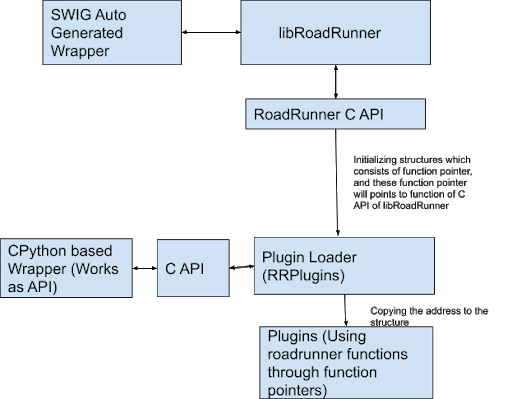

************************
rrPlugins Architecture
************************

The basic philosophy behind the design of the new architecture of rrplugins as compared to the old one
-------------------------------------------------------------------------------------------------------

Let’s first discuss what is the problem with the `old architecture <https://github.com/sys-bio/rrplugins/>`_ of rrplugins . Earlier roadrunner and rrplugins were separate entities. To build rrplugins first we need to build roadrunner then rrplugins using the libraries of libRoadRunner. In short rrplugins is dependent on roadrunner, so any change in roadrunner will need to rebuild the plugins. Also, there are two separate installations. So the primary objective was **any change in roadrunner will not affect plugins and any change in plugins will not affect roadrunner.**  

To do so instead of using roadrunner libraries directly we used roadrunner C API (Why C API because unless we change C API the user of the API will have no impact on the project). So if we change roadrunner and the API remains the same then we have no need to rebuild rrplugins.  

**Let’s dive into the broad implementation details**

Plugins are using the structure which consists of function pointers pointing towards C API functions of the roadrunner. This `approach <https://github.com/sys-bio/PluginSystemExample>`_ is devised from the mentor Dr. Herbert. We are using this because if we change libRoadRunner then plugins need to be rebuilt. But following this case, there will be no such requirements. 

Every plugin requires certain classes to be used. For example, cpp plugins require this `file <https://github.com/sys-bio/rrplugins/blob/master/rrplugins/core/telCPPPlugin.h>`_. Earlier this used to be a part of rrplugins core (plugin loader). Now since plugins need (classes) this and the plugin loader is dependent on roadrunner we can’t use plugin loader as a dependency. So we split the plugin loader into two parts:

- **Core** It consists of a minimal plugin loader

- **Plugin Base Class** It has all the base class require for plugins

Now plugins are dependent on Base classes only not the part which requires roadrunner as a dependency. So, a change in roadrunner will have no impact on plugins. 

To use roadrunner functionalities, the structure that consists of function pointers pointing towards C API functions of the roadrunner is used. Whenever a plugin loads, the plugin manager passes a pointer to the structure, so that plugin can access the roadrunner functionality using the function pointer.

**A block diagram describing the interaction is given below**
 

Extending support to C and other languages
----------------------------------------------

We can currently build plugins in C++ only. We can make plugins in any language which supports interaction with C++, **provided we need to make a separate API for them.** Let’s consider an example of C language. There is a C API already present so we can use it to make plugins. **But here is a catch.** Currently, the C API we have is dependent on the roadrunner. This means using that to build plugins will generate plugins that need to be rebuilt if roadrunner is changed. Now the big question is how to overcome this. To overcome this we can make API in such a way that we use only those functions which are not dependent on roadrunner. That is a way to achieve the task.

How to write a new plugin and use it in Python
------------------------------------------------

A minimal example to make a plugin is given in this `link <https://github.com/sys-bio/roadrunner/tree/develop/rrplugins/plugins/hello_roadrunner>`_. And for python consider this `python code <https://github.com/sys-bio/roadrunner/blob/develop/rrplugins/plugins/hello_roadrunner/docs/hello_roadrunner_example.py>`_. This is a minimal example and the complexity can be increased based on the need, but, the functions used here are necessary and need to be used for every plugin. 

Current issues
------------------

We can’t skip the parameters for minimization i.e. if we have 3 parameters S1, S2, and S3 **in the model** and we need to minimize based on S1 and S3, we can’t do that. It is due to a problem in `function <https://github.com/sys-bio/roadrunner/blob/develop/rrplugins/plugins/levenberg_marquardt/lmWorker.cpp#L518>`_. 

So in general if we have parameters S1, S2, S3,.....Sn we can use parameter S1, S2,...Si (prefix) only where 1<=i<=n only. 

Scope of Improvements
-----------------------

- At present to use any functionality of libRoadRunner we do it with roadrunner C API. But the problem with that is it converts roadrunner data types which are in C++ to C data types and then using pointers we reference that and again convert C to C++. It is a time-consuming process. Instead, we could use void pointers and send and then cast to appropriate data types on the side of the plugin.  This will significantly boost the performance. 

- A very long-term merging rrplugins python wrapper which is in CPython with SWIG. It will be a very tough task. It's super hard to debug code if something has gone wrong. I tried it but failed to merge and to be honest there is no present need for this and it can be delayed. 

