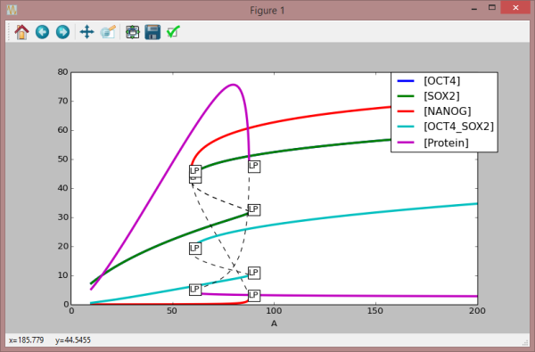

************************
AUTO2000 Plugin
************************

AUTO2000 Introduction
=====================

The AUTO2000 plugin serves as a front-end for the AUTO2000 library, which is a library for continuation and bifurcation problems in ordinary differential equations :sup:`1`.

Current limitations: Multiple continuation parameters are not supported, i.e. only one parameter can be selected for any continuation problem.

Available properties in the auto2000 plugin are documented in the next section. 

:sup:`1` AUTO2000 by Eusebius J. Doedel , Randy C. Paffenroth, Alan R. Champneys, Thomas F. Fairgrieve, Yuri A. Kuznetsov, Bart E. Oldeman, Bj�rn Sandstede and Xianjun Wang. See http://www.dam.brown.edu/people/sandsted/publications/auto2000.pdf. 

AUTO2000 Plugin Properties
==========================

The AUTO library has numerous properties that have been wrapped and made available to a plugin client. Each property is listed below with its data type, default value and a short description. For the exact usage and a more in detail description please consult the main AUTO2000 manual. 

The following properties are used internally by the auto library. Depending on the problem at hand, they may need to be tweaked. 

1. SBML: SBML document as a string. Model to be used by AUTO
2. TempFolder: Folder used by auto and the plugin for saving temporary files. Takes a string
3. KeepTempFiles: Boolean indicating if temporary files should be deleted after an AUTO session or not. Default is 'False'
4. ScanDirection: Parameter instructing AUTO how to sweep its principal continuation parameter. Either 'Positive' or 'Negative'. Default is 'Positive'
5. PrincipalContinuationParameter: The principal continuation parameter (PCP) is the first parameter that AUTO will sweep. Currently only one parameter is  supported, which by default is the PCP. Takes a string
6. BifurcationPoints: This integer vector holds the exact point number (in the sequence of all output data) for an AUTO solution point. It can be used together with the labels in the bifurcationlabels property to assist in plotting a bifurcation diagram.
7. BifurcationLabels: The string list holds the AUTO designated solution type label for a solution point, as found in the bifurcationpoints property. Consult the AUTO documentation for possible label types and their meaning 
8. BifurcationData: The BifurcationData property holds the bifurcation diagram after a session. The first column contains the values of the selected parameter, and successive columns are selected species 
9. fort2: Property containing the content of the AUTO temporary file, fort.2. Fort.2 is the input file for AUTO and created by the plugin 
10. fort3: Property containing the content of the AUTO temporary file, fort.3. The content of fort.3 file is undocumented in AUTO’s documentation 
11. fort6: Property containing the content of the AUTO temporary file, fort.6. The content of fort.6 file is a bifurcation session summary 
12. fort7: Property containing the content of the AUTO temporary file, fort.7. The content of fort.7 file is a bifurcation diagram on success 
13. fort8: Property containing the content of the AUTO temporary file, fort.8. The content of fort.8 file contain various statistics from the session 
14. fort9: Property containing the content of the AUTO temporary file, fort.8. Diagnostic messages, convergence history, eigenvalues, and Floquet multipliers are written in fort.9 
15. NDIM: The NDIM property correspond to the dimension of the system of equations 
16. IPS: Constant defining the problem type 
17. IRS: This constant sets the label of the solution where the computation is to be restarted. 
18. ILP: Fold detection; 1=ON, 0=OFF 
19. NICP: Property denoting the number of free parameters 
20. ICP: Free parameters 
21. NTST: The number of mesh intervals 
22. NCOL: The number of collocation points per mesh interval 
23. IAD: Mesh adaption every IAD steps; 0=OFF 
24. ISP: Bifurcation detection; 0=OFF, 1=BP(FP), 3=BP(PO,BVP), 2=all 
25. ISW: Branch switching: 1=normal, -1=switch branch (BP, HB, PD), 2=switch to two-parameter continuation (LP, BP, HB, TR) 3=switch to three-parameter continuation (BP) 
26. IPLT: This constant allows redefinition of the principal solution measure, which is printed as the second (real) column in the fort.7 output-file. See AUTO manual for possible settings 
27. NBC: Number of boundary conditions 
28. NINT: Number of integral conditions 
29. NMX: Maximum number of steps 
30. RL0: The lower bound on the principal continuation parameter 
31. RL1: The upper bound on the principal continuation parameter 
32. A0: The lower bound on the principal solution measure 
33. A1: The upper bound on the principal solution measure 
34. NPR: Save the solution in the solution file every NPR continuation steps 
35. MXBF: Automatic branch switching for the first MXBF bifurcation  points if IPS=0, 1 
36. IID: Control diagnostic output; 0=none, 1=little, 2=normal, 4=extensive 
37. ITMX: Maximum number of iterations for locating special solutions/points 
38. ITNW: Maximum number of correction steps 
39. NWTN: Corrector uses full newton for NWTN steps 
40. JAC: User defines derivatives; 0=no, 1=yes 
41. EPSL: Property setting the convergence criterion for parameters 
42. EPSU: Property setting the convergence criterion for solution components 
43. EPSS: Property setting the convergence criterion for special points 
44. DS: Session start step size 
45. DSMIN: Minimum continuation step size 
46. DSMAX: Maximum continuation step size 
47. IADS: Step size adaption every IADS steps; 0=OFF 
48. NTHL: The number of modified parameter weights (for BVP) 
49. THL: List of parameter weights 
50. NTHU: The number of modified solution component weights (for BVP) 
51. THU: List of solution weights 
52. NUZR: The number of user output points specified 
53. UZR: List of values for user defined output 

The execute Function
====================

The execute() function will start a bifurcation session. Depending on the problem at hand, the algorithm may run for a long time.
The execute() method supports a boolean argument indicating if the execution of the plugin work will be done in a thread, or not. If set to false, i.e. executing execute(false), the function will be a blocking function and will not return until the plugin work is done. If it is set to true, the execute(true) will return immediately and the plugin work will be executed in a thread. The user can use the isPluginDone(plugin) to query the status of the plugin progression.
The inThread argument defaults to false. 

AUTO2000 Plugin Events
======================

The auto2000 plugin uses all of the available plugin events, i.e. the PluginStarted, PluginProgress and the PluginFinished events.
The available data variables for each event are internally treated as pass through variables, so any data, for any of the events, assigned prior to the plugins execute function (in the assignOn() family of functions), can be retrieved unmodified in the corresponding event function. 

1. PluginStarted: Signals to application that the plugin has started applying noise on data. Both parameters are pass through parameters and are unused internally by the plugin. 
2. PluginProgress: Communicates progress of noise generation. Both parameters are pass through parameters and are unused internally by the plugin. 
3. PluginFinished: Signals to application that execution of the plugin has finished. Both parameters are pass through parameters and are unused internally by the plugin. 

Python examples
===============

The following Python script illustrates how the auto plugin can be invoked, how to set its properties and finally how to plot a bifurcation diagram. 

.. code-block:: python
   
   from rrplugins import * 
 
   try: 
       sbmlModel ="BIOMD0000000203.xml" 
       auto = Plugin("tel_auto2000") 

       #Setup Auto Propertys 
       auto.setProperty("SBML", readAllText(sbmlModel)) 
 
       #Auto specific properties 
       auto.setProperty("ScanDirection", "Positive") 
       auto.setProperty("PrincipalContinuationParameter", "A") 
       auto.setProperty("PCPLowerBound", 10) 
       auto.setProperty("PCPUpperBound", 200) 
 
       #Max numberof points 
       auto.setProperty("NMX", 5000) 
 
       #Execute the plugin 
       auto.execute() 
 
       # Bifurcation summary 
       print("Summary: " + auto.BifurcationSummary)
 
       #Plot Bifurcation diagram 
       pts     = auto.BifurcationPoints 
       lbls    = auto.BifurcationLabels 
       biData  = auto.BifurcationData 
 
       biData.plotBifurcationDiagram(pts, lbls) 
 
       print("Done") 
 
   except Exception as e: 
       print("There was a problem: " + `e`)
       

