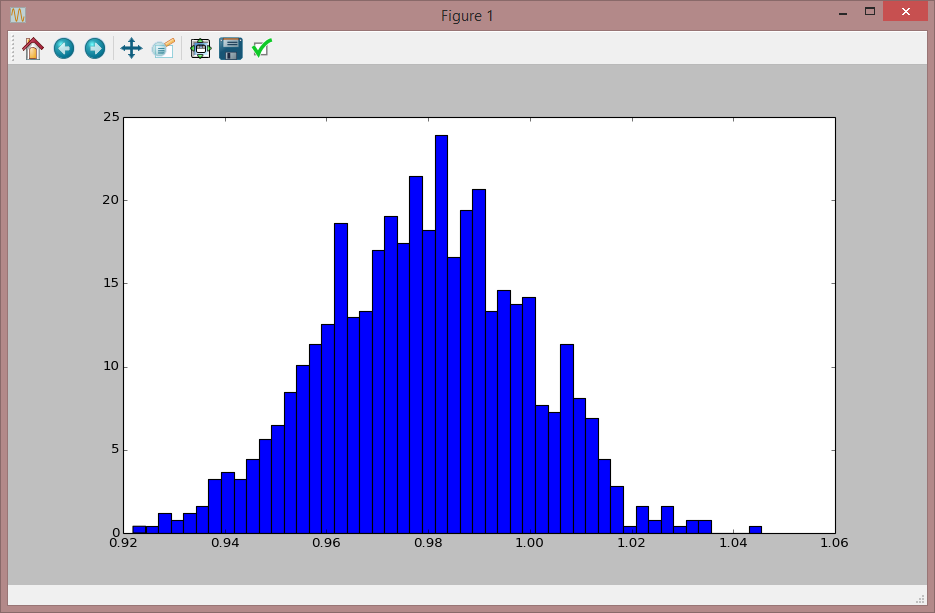

**************************************
Monte Carlo bootstrap algorithm Plugin
**************************************

Monte Carlo Introduction
========================

The Monte Carlo plugin is used to obtain estimates of the confidence limits for a model’s parameters. This is in the context where experimental data exists and a parameter minimization method, such as Levenberg-Marquardt or Nelder-Mead has already been used in order to find a parameter minimum.

The Monte Carlo algorithm is used subsequently at this minimum and will give an estimate of parameter confidence limits corresponding to the variance in the original experimental data.

The plugin has properties such as the size of the Monte Carlo population, minimization algorithm to use (e.g. Nelder-Mead or Levenberg-Marquardt), and on output, confidence limits for each involved parameter.

Plugin properties are documented in more detail in the next section. 

Monte Carlo Plugin Properties
=============================

Available properties in the Monte Carlo plugin are listed in the table below. 

1. SBML: SBML document as a string. Model to be used by the Monte Carlo plugin. 
2. ExperimentalData: Input data. 
3. InputParameterList: Parameters to estimate confidence limits for. 
4. MonteCarloParameters: Parameters obtained from a Monte Carlo session. 
5. ConfidenceLimits: Confidence limits for each fitted parameter. The confidence limits are calculated at a 95% confidence level. 
6. ExperimentalDataSelectionList: Selection list for experimental data. 
7. FittedDataSelectionList: Selection list for model data. 
8. NrOfMCRuns: Number of Monte Carlo data sets to generate and use. 
9. MinimizerPlugin: Minimizer used by the Monte Carlo Engine, e.g. ”Levenberg_Marquardt”. 

Monte Carlo Plugin Events
=========================

The Monte Carlo plugin uses all of the available plugin events, i.e. the PluginStarted, PluginProgress and the PluginFinished events.
The available data variables for each event are internally treated as pass through variables, so any data, for any of the events, assigned prior to the plugins execute function (in the assignOn() family of functions), can be retrieved unmodified in the corresponding event function. 

1. PluginStarted: Signals to application that the plugin has started applying noise on data. Both parameters are pass through parameters and are unused internally by the plugin. 
2. PluginProgress: Communicates progress of noise generation. Both parameters are pass through parameters and are unused internally by the plugin. 
3. PluginFinished: Signals to application that execution of the plugin has finished. Both parameters are pass through parameters and are unused internally by the plugin. 

The execute Function
====================

The execute() function will start the Monte Carlo algorithm. Depending on the problem at hand, the algorithm may run for a long time.
The execute(), method supports a boolean argument indicating if the execution of the plugin work will be done in a thread, or not. Threading is fully implemented in the Monte Carlo plugin.
The inThread argument defaults to false.
Each generated Monte Carlo dataset is available in a file named, MCDataSets.dat (saved in current working directory). 

Python examples
===============

The following Python script illustrates how the plugin can be used. 

.. code-block:: python
   
    from rrplugins import *
    import matplotlib.pyplot as plt

    try:    
        #Load plugins        
        modelP      = Plugin("tel_test_model")
        nP          = Plugin("tel_add_noise")    
        chiP        = Plugin("tel_chisquare")
        lmP         = Plugin("tel_levenberg_marquardt")
        nmP         = Plugin("tel_nelder_mead")
        mcP         = Plugin("tel_monte_carlo_bs") 

        #========== EVENT FUNCTION SETUP ===========================
        def myEventFunction(ignore):           
            # Get the fitted and residual data
            experimentalData    = lmP.getProperty ("ExperimentalData").toNumpy
            fittedData          = lmP.getProperty ("FittedData").toNumpy
            residuals           = lmP.getProperty ("Residuals").toNumpy
            
            telplugins.plot(fittedData         [:,[0,1]], "blue", "-",    "",    "S1 Fitted")
            telplugins.plot(fittedData         [:,[0,2]], "blue", "-",    "",    "S2 Fitted")
            telplugins.plot(residuals          [:,[0,1]], "blue", "None", "x",   "S1 Residual")
            telplugins.plot(residuals          [:,[0,2]], "red",  "None", "x",   "S2 Residual")
            telplugins.plot(experimentalData   [:,[0,1]], "red",  "",     "*",   "S1 Data")
            telplugins.plot(experimentalData   [:,[0,2]], "blue", "",     "*",   "S2 Data")
            
            print 'Minimization finished. \n==== Result ====' 
            print getPluginResult(lmP.plugin)
            telplugins.plt.show()       
                         
        #Communicating event
        myEvent =  NotifyEventEx(myEventFunction)
        
        #Uncomment the event assignment below to plot each monte carlo data set
        #assignOnFinishedEvent(lmP.plugin, myEvent, None)                    
        
        #This will create test data with noise. We will use that as 'experimental' data
        modelP.execute() 
               
        #Setup Monte Carlo properties.
        mcP.SBML                             = modelP.Model
        mcP.ExperimentalData                 = modelP.TestDataWithNoise
        
        #Select what minimization plugin to use                     
        #mcP.MinimizerPlugin                  = "Nelder-Mead"
        mcP.MinimizerPlugin                  = "Levenberg-Marquardt"
        mcP.NrOfMCRuns                       = 100
        mcP.InputParameterList               = ["k1", 1.5]
        mcP.FittedDataSelectionList          = "[S1] [S2]"
        mcP.ExperimentalDataSelectionList    = "[S1] [S2]"
        
        # Start Monte Carlo
        mcP.execute()
        
        print 'Monte Carlo Finished. \n==== Result ===='
        print mcP.MonteCarloParameters.getColumnHeaders()  
        paras = mcP.MonteCarloParameters.toNumpy
        print paras
           
        #Get mean (assuming normal distribution).
        print "The mean: k1= " + `np.mean(paras)`      
        
         
        PropertyOfTypeListHandle = getPluginProperty(mcP.plugin, "ConfidenceLimits")           
        print `getNamesFromPropertyList(PropertyOfTypeListHandle)`            
        aProperty = getFirstProperty(PropertyOfTypeListHandle)
        if aProperty:
            print getPropertyValueAsString(aProperty)
        
        #Show MOnte Carlo parameters as a histogram
        plt.hist(paras, 50, normed=True)
        plt.show()

        #Plot Monte Carlo data sets        
        #dataSeries =  DataSeries.readDataSeries("MCDataSets.dat")    
        #dataSeries.plot()           

        #Finally, view the manual and version
        mcP.viewManual()    
        print 'Plugin version: ' + `mcP.getVersion()`
                 
        
    except Exception as e:
        print 'Problem.. ' + `e`    
    

